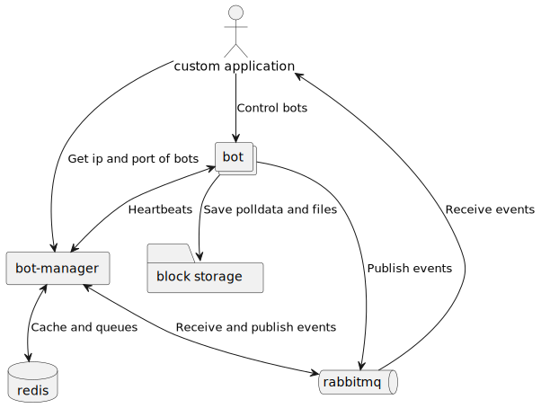

# Architecture

TF2 Automatic is made up of different applications with different responsibilities. At its core, there is the [bot](../apps/bot) and [bot-manager](../apps/bot-manager/).

The applications communicate with each other using HTTP APIs and events. The events are sent to a [RabbitMQ](https://www.rabbitmq.com/) message broker to ensure that anyone who wants the events will receive them. The events that the system generates can also be listened to by custom applications.

## Core applications and communications

In order to better understand the communication between applications, the following diagram has been made.

Diagram of the core architecture.

### Custom applications

Custom applications can communicate with the bot and bot-manager, and receive events from RabbitMQ. The custom applications contains business logic to create custom trading logic that uses the APIs and events of the system and its different services.

### Bot manager

The bot manager is an optional part of the system, but it makes it possible to keep track of multiple bots, and it also provides different APIs to improve reliability and stability, such as fetching and caching inventories. The bot sends optional heartbeats to the bot manager. This allows the bot manager to keep track of active bots and provide this information to other applications.

### Bot

The bot acts as a Steam client and is controlled using a HTTP API. The bot also publishes events to RabbitMQ, such as friend requests, messages received, trades received, etc.

Under the hood, the bot uses all the "standard" NPM packages used to create a Steam bot, such as:

- [node-steam-user](https://github.com/DoctorMcKay/node-steam-user) to create a Steam client
- [node-steamcommunity](https://github.com/DoctorMcKay/node-steamcommunity) to send requests to Steam
- [node-steam-tradeoffer-manager](https://github.com/DoctorMcKay/node-steam-tradeoffer-manager) to automate trading
- [node-tf2](https://github.com/DoctorMcKay/node-tf2) to interact with the TF2 Game coordinator

Instead of having to write the same boilerplate code, you can use the bot and its APIs..

The bot also saves different files, such as [polldata](https://github.com/DoctorMcKay/node-steam-tradeoffer-manager/wiki/Polling#poll-data), item descriptions, and sentry files. It can be configured to save these files to either a local folder, or an [S3](https://docs.aws.amazon.com/AmazonS3/latest/userguide/Welcome.html) compatible bucket.

### Redis

[Redis](https://redis.io/) is used by the bot manager for caching and queuing.

### RabbitMQ

RabbitMQ is a message broker that allows for messages to be published and routed to different queues. Applications can consume the messages in the queue. Examples on how to use RabbitMQ can be found [here](https://www.rabbitmq.com/tutorials/tutorial-one-javascript.html).
