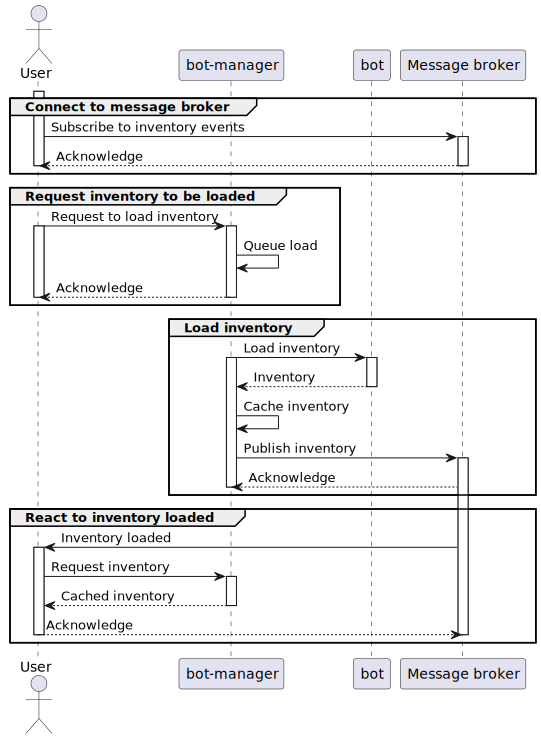
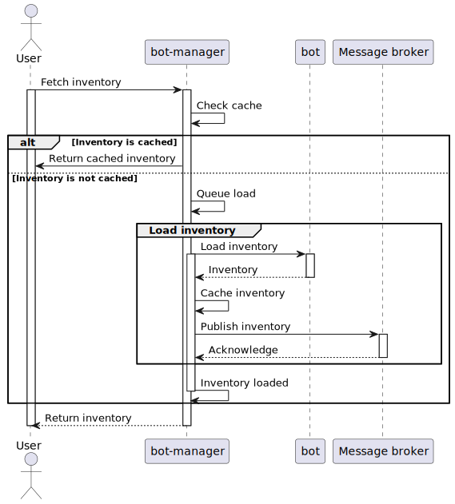

# Features

These sections highlights different features of the system and how to use them.

## Inventories

Inventories can be loaded directly using a bot. But the more reliable method is to use the bot-manager. The bot manager can load inventories using bots and then caches the result. Cached inventories will be updated when trades are accepted (or rolled back) using the exchange details, or when items are removed from the inventory using the TF2 GC events. Items are not added to the inventories using the TF2 GC events because they are not in the correct format.

### Two-Request Method (event-based)

The first approach is to send two requests. The first request is to queue the inventory to be loaded. And the second request is to retrieve it from the cache. Events are used to know when the inventory has been cached.

The diagram above shows the process. It is fairly involved but can be broken up into four parts:

1. Connect to the message broker and subscribe to inventory events.
2. Request the bot-manager to load the inventory.
3. The bot-manager attempts to fetch the inventory using a bot. Once it is fetched, it will cache the inventory and publish that the inventory has been loaded.
4. You can then react to the inventory loaded event and fetch the cached inventory from the bot-manager.

### Single Request Method (long polling)

The second, and much simpler approach, is to fetch the inventory using a single request.

The fetch method looks for the inventory in the cache and returns it if available. If not, it adds it to the queue, waits for it to be loaded, and then returns it.

### Exchange details

When the state of a trade becomes accepted, the offer is added to an internal queue to get the exchange details. The exchange details contains the items exchanged and their new assetids.

Relative to each account in the trade, if they have a cached inventory, then their lost items are removed from their cached inventory, and the items they gained are added to their cached inventory. This can be used to reduce the need for an inventory to be fetched but the inventories still need to be updated once in a while. How regularly you fetch the inventory depends on your use.

The system does not fetch inventories, but it tries to keep cached inventories up to date by deleting lost items, and adding items received from trades.

## Trades

Trade actions are added to a queue to ensure that they will happen. Actions can be queued even if the bot that has to make the action is offline.

The trades queue can take 6 different types of jobs - create, remove (decline / cancel), accept, confirm, counter and refresh.
